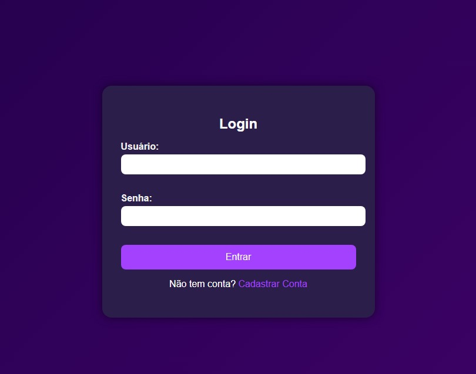
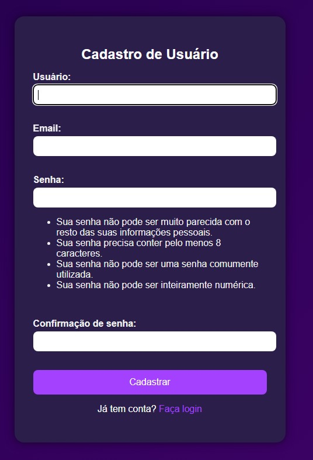
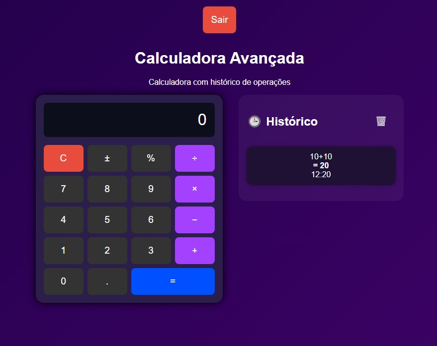

# 📟 Calculadora com Django

Este é o projeto desenvolvido para um desafio técnico. A aplicação é uma **calculadora web com login, cadastro de usuários e histórico de operações**, construída com **Django** e **SQLite**.

---

## 🚀 Funcionalidades

- ✅ Tela de login e cadastro com layout personalizado
- ✅ A calculadora realiza operações básicas como adição (+), subtração (−), multiplicação (×) e divisão (÷). Além disso, o símbolo % é interpretado como módulo, ou seja, o resto da divisão inteira entre dois números. Por exemplo: 100 % 98 = 2 → resto da divisão de 100 por 98.
- ✅ Histórico de operações por usuário
- ✅ Possibilidade de limpar o histórico
- ✅ Interface moderna com layout responsivo
- ✅ Painel administrativo com autenticação (Django Admin)

---

## 📸 Interface

### 🔐 Tela de Login


### 🧾 Tela de Cadastro


### ➗ Calculadora com Histórico


---

## 🛠️ Tecnologias utilizadas

- [Python 3.11+](https://www.python.org/)
- [Django 5.x](https://www.djangoproject.com/)
- SQLite3 (banco local)
- HTML + CSS (customizados)
- JavaScript (vanilla)

---

## ⚙️ Como executar o projeto

1. **Clone o repositório**:

```bash
git clone https://github.com/seu-usuario/seu-repositorio.git
cd seu-repositorio
```

2. **Crie e ative um ambiente virtual**:

```bash
python -m venv venv
venv\Scripts\activate     # No Windows
# ou
source venv/bin/activate  # No Linux/macOS
```

3. **Instale as dependências**:

```bash
pip install -r requirements.txt
```

4. **Aplique as migrações**:

```bash
python manage.py migrate
```

5. **Rode o servidor**:

```bash
python manage.py runserver
```

6. **Acesse em: http://127.0.0.1:8000/**

## 🧪 Como testar o sistema

1. **Cadastre um novo usuário**

2. **Faça login**

3. **Utilize a calculadora com histórico lateral**

4. **Use o botão 🗑️ para limpar o histórico**

## 🔐 Acesso ao painel administrativo (opcional)

1. **Crie um superusuário**:

```bash
python manage.py createsuperuser
```

2. **Acesse: http://127.0.0.1:8000/admin/**

3. **Faça login com o usuário e senha criados**

## 🗂️ Estrutura de Diretórios

```text
calculadora_site/
├── calculadora_app/          # App principal da calculadora
│   ├── static/
│   │   └── core/             # Arquivos estáticos (CSS, JS, imagens)
│   │       └── style.css     # Estilo da interface
│   ├── templates/
│   │   └── core/             # Templates HTML renderizados pelas views
│   │       ├── login.html
│   │       ├── cadastro.html
│   │       └── calculadora.html
│   ├── views.py              # Lógica de visualização
│   ├── models.py             # Modelos de dados
│   └── urls.py               # Definição de rotas da aplicação
├── manage.py                 # Gerenciador do projeto Django
└── requirements.txt          # Lista de dependências do projeto
